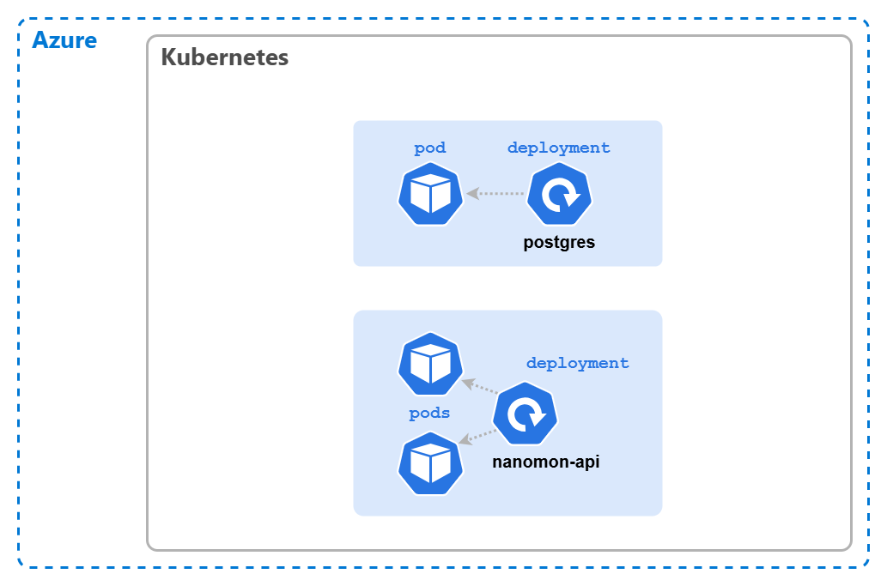

# 🚀 Deploying The Backend

We'll deploy the app piece by piece, and at first we'll deploy & configure things in a sub-optimal way.
This is in order to explore the Kubernetes concepts and show their purpose. Then we'll iterate and improve towards the final architecture.

We have four "microservices" we need to deploy, and due to dependencies between them we'll start with the PostgreSQL database then the API and then move onto the frontend.

From here we will be creating and editing files, so it's worth creating a project folder locally (or even a git repo) in order to work from if you haven't done so already.

## 🍃 Deploying PostgreSQL

We'll apply configurations to Kubernetes using `kubectl` and YAML manifest files, and we'll be doing this a lot throughout the workshop.
These files will describe the objects we want to create, modify and delete in the cluster.

If you want to take this workshop slowly and treat it as more of a hack, you can research and build the required YAML yourself, you can use [the Kubernetes docs](https://kubernetes.io/docs/concepts/workloads/controllers/deployment/) and the following hints:

- _Deployment_ should be used with a single replica.
- The image to be run is `{ACR_NAME}.azurecr.io/nanomon/postgres:latest`. Where `{ACR_NAME}` should be replaced with the name of your ACR resource.
- The port **5432** should be exposed from the container.
- Do not worry about persistence or using a _Service_ at this point.
- Set `POSTGRES_DB` and `POSTGRES_USER` environmental vars to the container setting both to the value "nanomon"
- Set `POSTGRES_PASSWORD` environmental var, with the value "notVerySecret123!". Yes a plain text password, we will fix this later!

> 📝 NOTE: Why are we not using the official [PostgreSQL image](https://hub.docker.com/_/postgres)? Well really we should, but initializing database schema would require concepts like config maps & volume mounts which we're not ready for yet.  
> The nanomon/postgres image has been specifically built with the database initialization baked in, so we can keep things simple for now.

Alternatively you can use the YAML below to paste into `postgres-deployment.yaml`, don't worry this isn't cheating, in the real world everyone is too busy to write Kubernetes manifests from scratch 😉

<details markdown="1">
<summary>Click here for the PostgreSQL deployment YAML</summary>

```yaml
apiVersion: apps/v1
kind: Deployment

metadata:
  name: postgres

spec:
  replicas: 1
  selector:
    matchLabels:
      app: postgres
  template:
    metadata:
      labels:
        app: postgres
    spec:
      containers:
        - name: postgres
          image: {ACR_NAME}.azurecr.io/nanomon/postgres:latest
          ports:
            - containerPort: 5432
          env:
            - name: POSTGRES_DB
              value: "nanomon"
            - name: POSTGRES_USER
              value: "nanomon"
            - name: POSTGRES_PASSWORD
              value: "notVerySecret123!"
```

</details>

Then apply the manifest with:

```bash
kubectl apply -f postgres-deployment.yaml
```

If successful you will see `deployment.apps/postgres created`, this will have created one _Deployment_ and one _Pod_. You can check the status of your cluster with a few commands:

- `kubectl get deployment` - List the deployments, you should see _1/1_ in ready status.
- `kubectl get pod` - List the pods, you should see one prefixed `postgres-` with a status of _Running_.
- `kubectl describe deploy postgres` - Examine and get details of the deployment.
- `kubectl describe pod {podname}` - Examine the pod, you will need to get the name from the `get pod`
  command.
- `kubectl get all` - List everything; all pods, deployments etc.

Get used to these commands you will use them a LOT when working with Kubernetes.

For the next part we'll need the IP address of the pod that was just deployed, you can get this by running `kubectl get pod -o wide` or the command below:

```bash
kubectl describe pod --selector app=postgres | grep ^IP:
```

## 🗃️ Deploying The API

Next we'll deploy the first custom part of our app, the backend API, and like the DB we'll deploy it from an image hosted in our private registry.

- The image needs to be `{ACR_NAME}.azurecr.io/nanomon/api:latest` where `{ACR_NAME}` should be
  replaced in the YAML with your real value, i.e. the name of your ACR resource.
- Set the number of replicas to **2**.
- The port exposed from the container should be **8000**.
- An environmental variable called `POSTGRES_DSN` should be passed to the container, with the connection string to connect to the database, which will be `host={POSTGRES_POD_IP} port=5432 user=nanomon dbname=nanomon sslmode=disable` where `{POSTGRES_POD_IP}` should be replaced in the YAML with the pod IP address you just queried.
- A second environmental variable called `POSTGRES_PASSWORD` should be passed to the container, with the value `notVerySecret123!`.
- Label the pods with `app: nanomon-api`.

Again you can try building the _Deployment_ yourself or use the provided YAML to create a `api-deployment.yaml` file

<details markdown="1">
<summary>Click here for the API deployment YAML</summary>

```yaml
kind: Deployment
apiVersion: apps/v1

metadata:
  name: nanomon-api

spec:
  replicas: 2
  selector:
    matchLabels:
      app: nanomon-api
  template:
    metadata:
      labels:
        app: nanomon-api
    spec:
      containers:
        - name: api-container

          image: {ACR_NAME}.azurecr.io/nanomon/api:latest
          imagePullPolicy: Always

          ports:
            - containerPort: 8000

          env:
            - name: POSTGRES_DSN
              value: "host={POSTGRES_POD_IP} port=5432 user=nanomon dbname=nanomon sslmode=disable"
            - name: POSTGRES_PASSWORD
              value: "notVerySecret123!"
```

</details>

**💥 Notice:** We have the password in plain text within the connection string! This clearly is a very bad practice, we will fix this at a later stage when we introduce Kubernetes _Secrets_.

Make the changes described above, **remember to make the edits, you can not use this YAML as is!**, and then run:

```bash
kubectl apply -f api-deployment.yaml
```

Check the status as before with `kubectl` and it's worth checking the logs with `kubectl logs {podname}` to see the output from the app as it starts up.

This time we've set the number of replicas to two, if you run `kubectl get pods -o wide` you will see which _Nodes_ the _Pods_ have been scheduled (assigned) to.
You might see each _Pod_ has been scheduled to different _Nodes_, but this is not guaranteed. _Pod_ scheduling and placement is a fairly complex topic, for now we can move on.

It's also worth mention the _Pod_ names, they are prefixed with the name of the _Deployment_, followed by a hash, folowed by a random string. _Pod_ names are nearly always auto-generated like this,
and are not something you should rely on or try to set yourself.

## ⏩ Accessing the API (The quick & dirty way)

Now it would be nice to access and call this API, to check it's working. But the IP address of the
_Pods_ are private and only accessible from within the cluster. In the next section we'll fix that,
but for now there's a short-cut we can use.

Kubernetes provides a useful way to "tunnel" network traffic into the cluster through the control plane,
this is done with the `kubectl port-forward` command.

Pick the name of either one of the two `api` _Pods_, and run:

```bash
kubectl port-forward {pod_name} 8000:8000
```

And then accessing the following URL [http://localhost:4000/api/info](http://localhost:4000/api/info) either in your browser or with `curl` we should see a JSON response with some status and debug
information from the API.

```sh
curl -s http://localhost:8000/api/status | json_pp
```

Clearly this isn't a good way to expose your apps long term, but can be extremely useful when debugging and triaging issues.

When done, cancel & close the port-forwarding with `ctrl-c`

## 🖼️ Cluster & Architecture Diagram

The resources deployed into the cluster & in Azure at this stage can be visualized as follows



Yes, it's looking a little empty at this stage, don't worry it'll become a lot more complex soon!

## Navigation

[Return to Main Index 🏠](../readme.md) ‖
[Previous Section ⏪](../03-the-application/readme.md) ‖ [Next Section ⏩](../05-network-basics/readme.md)
