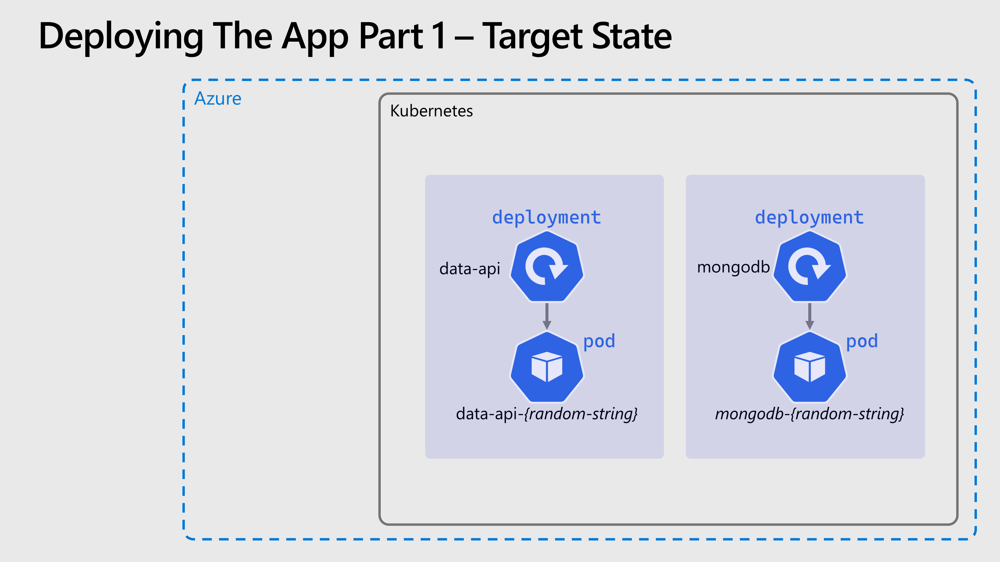

# 🚀 Deploying The App - Part 1

We'll deploy the app piece by piece, and at first we'll deploy & configure things in a very sub-optimal way. This is in order to explore the Kubernetes concepts and show their purpose. Then we'll iterate and improve towards the final architecture.

We have three microservices we need to deploy, and due to dependencies between them we'll start with the MongoDB database then the data API and then finally move onto the frontend.

From here we will be creating and editing files, so it's worth creating a project folder locally (or even a git repo) in order to work from if you haven't done so already.

## 🍃 Deploying MongoDB

We'll apply configurations to Kubernetes using kubectl and YAML manifest files. These files will describe the objects we want to create, modify and delete in the cluster.

If you want to take this workshop slowly and research how to do this in order to build the required YAML yourself, you can use [the Kubernetes docs](https://kubernetes.io/docs/concepts/workloads/controllers/deployment/) and the following hints:

- *Deployment* should be used with a single replica.
- The image to be run is `mongo:latest`. Note: This is not really part of our app, it's the the public MongoDB image hosted on Dockerhub.
- The port **27017** should be exposed from the container.
- Do not worry about persistence or using a *Service* at this point.

Alternatively you can use the YAML below, don't worry this isn't cheating, in the real world everyone is too busy to write Kubernetes manifests from scratch 😉

<details markdown="1">
<summary>Click here for the MongoDB deployment YAML</summary>

```yaml
kind: Deployment
apiVersion: apps/v1

metadata:
  name: mongodb

spec:
  replicas: 1
  selector:
    matchLabels:
      app: mongodb
  template:
    metadata:
      labels:
        app: mongodb
    spec:
      containers:
        - name: mongodb-container

          image: mongo:latest
          imagePullPolicy: Always

          ports:
            - containerPort: 27017

          resources:
            limits:
              memory: "128Mi"
              cpu: "500m"
```

</details>

Paste this into a file `mongo-deployment.yaml` and then run:

```bash
kubectl apply -f mongo.deployment.yaml
```
  
If successful you will see `deployment.apps/mongodb created`, this will have created one *Deployment* and one <abbr title="The smallest and simplest Kubernetes object. A Pod represents a set of running containers on your cluster">*Pod*</abbr>. You can check the status of your cluster with a few commands:

- `kubectl get deployment` - List the deployments, you should see 1/1 in ready status.
- `kubectl get pod` - List the pods, you should see one prefixed `mongodb-` with a status of *Running*
- `kubectl describe deploy mongodb` - Examine and get details of the deployment.
- `kubectl describe pod {podname}` - Examine the pod, you will need to get the name from the `get pod` command.
- `kubectl get all` - List everything; all pods, deployments etc.

Get used to these commands you will use them a LOT when working with Kubernetes.

For the next part we'll need the IP address of the pod that was just deployed, you can get this by running `kubectl get pod -o wide` or the command below

```bash
kubectl describe pod --selector app=mongodb | grep ^IP:
```

## 🗃️ Deploying The Data API

Next we'll deploy the first custom part of our app, the data API, and we'll deploy it from an image hosted in our private registry. Once again you can try building the *Deployment* yourself or use the provided YAML

- The image needs to be `${ACR_NAME}.azurecr.io/smilr/data-api` where `${ACR_NAME}` should be replaced in the YAML with your real value.
- The port exposed from the container should be **4000**
- An environmental variable called `MONGO_CONNSTR` should be passed to the container, with the connection string to connect to the MongoDB, which will be `mongodb://${MONGODB_POD_IP}` where `${MONGODB_POD_IP}` should be replaced in the YAML with the value you just got

<details markdown="1">
<summary>Click here for the MongoDB deployment YAML</summary>

```yaml
kind: Deployment
apiVersion: apps/v1

metadata:
  name: data-api

spec:
  replicas: 1
  selector:
    matchLabels:
      app: data-api
  template:
    metadata:
      labels:
        app: data-api
    spec:
      containers:
        - name: data-api-container

          image: ${ACR_NAME}.azurecr.io/smilr/data-api
          imagePullPolicy: Always

          ports:
            - containerPort: 4000

          resources:
            limits:
              memory: "128Mi"
              cpu: "500m"

          env:
            - name: MONGO_CONNSTR
              value: mongodb://${MONGODB_POD_IP}
```

</details>

Paste this into a file `data-api-deployment.yaml` and make the changes described above, **remember you can not use this YAML as is**, and then run:

```bash
kubectl apply -f data-api.deployment.yaml
```

Check the status as before with `kubectl` and it's worth checking the logs with `kubectl logs {podname}` to see the output from the app as it starts up. 

## ⏩ Accessing the Data API (The quick & dirty way)

Now it would be nice to access and call this API, to check it's working. But the IP address of the <abbr title="The smallest and simplest Kubernetes object. A Pod represents a set of running containers on your cluster">*Pod*</abbr> is private and only accessible from within the cluster. In the next section we'll fix that, but for now there's a short-cut we can use. 

Kubernetes provides a way to "tunnel" network traffic into the cluster through the control plane, this is done with the `kubectl port-forward` command

By running:

```
kubectl port-forward {podname} 4000:4000
```

And then accessing the following URL http://localhost:4000/api/info we should see a JSON response with some status and debug information from the API. Clearly this isn't a way to expose your apps long term, but can be extremely useful when debugging and triaging issues.

## 🖼️ Cluster & Architecture Diagram

The resources deployed into the cluster & in Azure at this stage can be visualized as follows:

