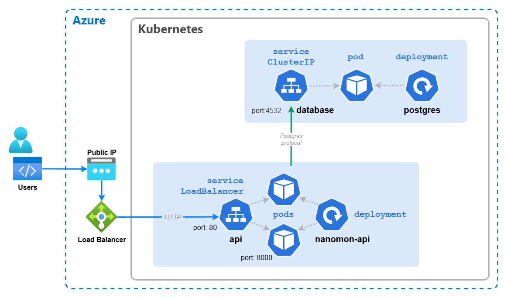

# 🌐 Basic Networking

Pods are both ephemeral and "mortal", they should be considered effectively transient. Kubernetes can terminate and
reschedule pods for a whole range of reasons, including rolling updates, hitting resource limits, scaling up & down and
other cluster operations. With Pods being transient, you can not build a reliable architecture through addressing Pods
directly (e.g. by name or IP address).

Kubernetes solves this with _Services_, which act as a network abstraction over a group of pods, and have their own
independent and more stable life cycle. We can use them to greatly improve what we've deployed.

## 🧩 Deploy PostgreSQL Service

Now to put a _Service_ in front of the PostgreSQL pod, if you want to create the service YAML yourself, you can refer to
the Kubernetes docs:

[📚 Kubernetes Docs: Services](https://kubernetes.io/docs/concepts/services-networking/service)

- The type of _Service_ should be `ClusterIP` which means it's internal to the cluster only
- The service port should be **5432**.
- The target port should be **5432**.
- Selector decides what pods are behind the service, in this case use the label `app` and the value `postgres`. It is
  crucial that this matches the label on the pods,otherwise the service will not be able to route traffic to them.

> 📝 NOTE: Labels are optional metadata that can be added to any object in Kubernetes, they are simply key-value pairs.
> Labels can be used to organize and to select subsets of objects. The label "app" is commonly used, but has **no
> special meaning**, and isn't used by Kubernetes in any way

Save your YAML into a file `postgres-service.yaml` or use the below YAML manifest for the service:

<details markdown="1">
<summary>Click here for the PostgreSQL service YAML</summary>

```yaml
kind: Service
apiVersion: v1

metadata:
  # We purposefully pick a different name for the service from the deployment
  name: database

spec:
  type: ClusterIP
  selector:
    app: postgres
  ports:
    - protocol: TCP
      port: 5432
      targetPort: 5432
```

</details>

Apply it to the cluster as before:

```bash
kubectl apply -f postgres-service.yaml
```

You can use `kubectl` to examine the status of the _Service_ just like you can with _Pods_ and _Deployments_:

```bash
# Get all services
kubectl get svc

# Get details of a single service
kubectl describe svc {service-name}
```

> 📝 NOTE: You might spot a service called 'kubernetes', which exists in the default namespace and is placed there
> automatically, despite sounding very important you can completely ignore it.

🛑 **EXTRA NOTE**: As mentioned in part 3, there are varied opinions on running databases inside Kubernetes. As a
general rule it would be advised to use a hosted cloud database service which resides outside your cluster and can be
managed independently. However we will continue with PostgreSQL running in the cluster in the interests of learning.

## 📡 Connect the API to the PostgreSQL Service

Now we have a Service in our cluster for PostgreSQL we can access the database using DNS rather than IP, and if the
pod(s) die, restart or move; this name remains constant. DNS with Kubernetes is a complex topic we won't get into here,
the main takeaway for now is:

- Every _Service_ in the cluster can be resolved over DNS.
- Within a _Namespace_, the _Service_ name will resolve as a simple hostname, without the need for a DNS suffix.
  However, if you want to be more explicit you can use the full DNS name which is:
  `{service-name}.{namespace}.svc.cluster.local`

[📚 Kubernetes Docs: DNS for Services and Pods](https://kubernetes.io/docs/concepts/services-networking/dns-pod-service/)

Edit the the `api-deployment.yaml` file you created previously and change the value of the `POSTGRES_DSN` environmental
variable. Replace the IP address with name of the service, e.g. the connection string should start with `host=database`.

You can update the active deployment with these changes by re-running `kubectl apply -f api-deployment.yaml`. Kubernetes
will perform a rolling update, if you are quick and run `kubectl get pods` you might see it taking place, i.e. a new pod
starting & the old one terminating. Again you can check the status and the logs using `kubectl`.

## 🌍 Expose the Data API externally

We can create a different type of _Service_ in front of the data API, in order to expose it outside of the cluster and
also to the internet. To do this use a Service with the type `LoadBalancer`, this will be picked up by Azure and a
public IP assigned and traffic routed through an Azure LoadBalancer in front of the cluster. How this happens is well
outside of the scope of this workshop. Once again the selector is very important, it should match the label on the pods,
which in this case is `app: nanomon-api`, without this the service can not know which pods it should route traffic to.

We can also change the port at the _Service_ level, so the port exposed by the _Service_ doesn't need to match the one
that the container is listening on. In this case we'll re-map the port to **80**.

Save your YAML into a file `api-service.yaml` from above or below.

<details markdown="1">
<summary>Click here for the data API service YAML</summary>

```yaml
kind: Service
apiVersion: v1

metadata:
  name: api

spec:
  type: LoadBalancer
  selector:
    app: nanomon-api
  ports:
    - protocol: TCP
      port: 80
      targetPort: 8000
```

</details>

Apply it to the cluster with the now familiar `kuectl apply` command:

```bash
kubectl apply -f api-service.yaml
```

Using `kubectl get svc` check the status and wait for the external IP to be assigned, which might take a minute or two.
Then go to the address in your browser `http://{EXTERNAL_IP}/api/status` and you should get the same JSON response as
before.

Clearly this is better than what we had before, but in production you would never expose plain HTTP traffic directly
into your pods like this! Later we can improve this yet further, but for now it will suffice.

## 🖼️ Cluster & Architecture Diagram

The resources deployed into the cluster & in Azure at this stage can be visualized as follows:



## Navigation

[Return to Main Index 🏠](../) ‖ [Previous Section ⏪](../04-deployment/) ‖ [Next Section ⏩](../06-frontend/)
