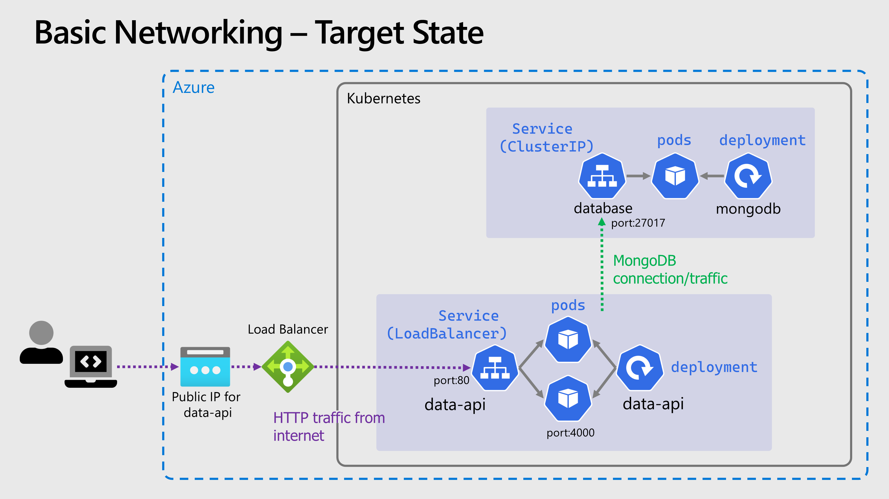

# 🌐 Basic Networking

Pods are both ephemeral and "mortal", they should be considered effectively transient. Kubernetes can terminate and reschedule pods for a whole range of reasons, including rolling updates, hitting resource limits, scaling up & down and other cluster operations.

Kubernetes solves this with *Services*, which act as a network abstraction over a group of pods, and have their own lifecycle. We can use them to greatly improve what we've deployed

## 🧩 Deploy MongoDB Service

Now to put a *Service* in front of the MongoDB pods, if you want to create the service YAML yourself, you can [refer to the Kubernetes docs](https://kubernetes.io/docs/concepts/services-networking/service/#defining-a-service)

- The type of `Service` should be `ClusterIP` which means it's internal to the cluster only
- The service port should be **27017**
- The target port should be **27017**
- Selector decides what pods are behind the service, in this case use the label `app` and the value `mongodb`

> 📝 NOTE: Labels are metadata that can be added to any object in Kubernetes, they are simply key-value pairs. The label "app" is commonly used, but has **no special meaning**, and isn't used by Kubernetes in any way

A completed YAML manifest for the service is given below:

<details markdown="1">
<summary>Click here for the MongoDB service YAML</summary>

```yaml
kind: Service
apiVersion: v1

metadata:
  name: database

spec:
  type: ClusterIP  
  selector:
    app: mongodb
  ports:
    - protocol: TCP
      port: 27017
      targetPort: 27017
```

</details>

Save your YAML into a file `mongo-service.yaml` and apply it to the cluster as before, with 

```bash
kubectl apply -f mongo-service.yaml
```

You can use `kubectl` to examine the status of the *Service* just like you can with *Pods* and *Deployments*

```bash
# Get all services
kubectl get svc

# Get details of a single service
kubesctl describe svc {service-name}
```

## ➡️ Connect the API to MongoDB Service

Now we have a Service in our cluster for MongoDB we can access the database using DNS rather than pod IP and if the pod(s) die or restart or move; this name remains constant. DNS with Kubernetes is a complex topic we won't get into here, the main takeway for now is:

- Every *Service* in the cluster can be resolved over DNS
- Within a *Namespace*, the *Service* name will resolve as is, [but other scenarios also are supported](https://kubernetes.io/docs/concepts/services-networking/dns-pod-service/).

Edit the the `data-api-deployment.yaml` file you created previously and change the value of the `MONGO_CONNSTR` environmental variable. Replace the IP address with name of the service, e.g. `mongodb://database`

You can update the active deployment with these changes by re-running `kubectl apply -f data-api-deployment.yaml`, Kuberenetes will perform a rolling update, if you are quick and run `kubectl get pods` you might see it taking place, i.e. a new pod starting & the old one terminating. Again you can check the status and the logs using `kubectl`

## 🌍 Expose the Data API externally

We can create a different type of *Service* in front of the data API, in order to expose it outside of the cluster and also to the internet. To do this use a Service with the type `LoadBalancer`, this will be picked up by Azure and a public IP assigned. How this happens is well outside of the scope of this workshop.

We can also change the port at the *Service* level, so the port exposed by the *Service* doesn't need to match the one that the container is listening on. In this case we'll change the port to **80**

<details markdown="1">
<summary>Click here for the data API service YAML</summary>

```yaml
kind: Service
apiVersion: v1

metadata:
  name: data-api

spec:
  type: LoadBalancer
  selector:
    app: data-api
  ports:
    - protocol: TCP
      port: 80
      targetPort: 4000
```

</details>

Save your YAML into a file `data-api-service.yaml` and apply it to the cluster as before, with 

```bash
kubectl apply -f data-api-service.yaml
```

Using `kubectl get svc` check the status and wait for the external IP to be assigned, which might take a minute or two. Then go to the address in your browser http://{EXTERNAL_IP}/api/info/ and you should get the same JSON response as before

Clearly this is better than what we had before, but in production you would never expose traffic directly into your pods like this, so we can improve this further but for now it will suffice

## Cluster & Architecture Diagram

The resources deployed into the cluster & in Azure at this stage can be visualized as follows:

