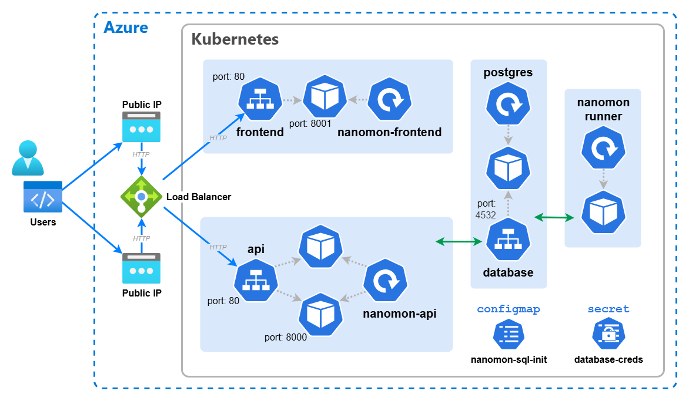

# 🏆 The Continued Path to Production Readiness

We're not done improving things yet! This section is a continuation of the previous one, where we will further enhance our deployment by adding a few more important features. Using _ConfigMaps_ and volumes, we'll continue stepping towards a more production-ready deployment.

Remember, back in the section 4 where we set up our Postgres database, we used a pre-built container image that automatically initialized the database & schema needed to run our application. This really was little more than a hacky workaround to get us up and running quickly, and in a real-world scenario, we should use the official Postgres image and inject the initialization script(s) at runtime. This is what we'll do in this section. This is a pattern you should adopt in your own applications, as baking in configuration and initialization data into your container images is not a good practice.

## 🗺️ ConfigMaps

A _ConfigMap_ in Kubernetes is an API object used to store non-confidential configuration data. _ConfigMaps_ allow you to decouple configuration artifacts from image content and your application code. They can be used to store settings, scripts and entire configuration files. They are a little like _Secrets_, but are intended for non-sensitive data, and can be created from files.

[📚 Kubernetes Docs: ConfigMaps](https://kubernetes.io/docs/concepts/configuration/configmap/)

In our case, we'll use a _ConfigMap_ to store the database initialization SQL script, which will then be mounted into the Postgres container.

The SQL script can be [found here](https://raw.githubusercontent.com/benc-uk/kube-workshop/refs/heads/main/08-more-improvements/nanomon_init.sql). You can grab into a file using `curl` like so:

```bash
curl -O https://raw.githubusercontent.com/benc-uk/kube-workshop/refs/heads/main/08-more-improvements/nanomon_init.sql
```

We can then create a _ConfigMap_ from this file using `kubectl`

```bash
kubectl create configmap nanomon-sql-init --from-file=nanomon_init.sql
```

> 📝 NOTE: Like every object in Kubernetes, ConfigMaps can also be created with a YAML manifest, but when working with external files/scripts etc, kubectl is your only real option.

There are three mains ways to use a _ConfigMap_ in with a _Pod_: as container command and args, as environment variables, or as files in a volume. In this section we'll use the volume method.

## 💾 Volumes & Volume Mounts

A Volume in Kubernetes is a directory that is accessible to containers in a pod. Volumes are used to persist data, share data between containers, and manage configuration. When it comes to persisting data and storage in Kubernetes, it's a stageringly complex & deep topic. However volumes can also be used to easily provide a container with access to configuration files, via a _ConfigMap_.

[📚 Kubernetes Docs: Volumes](https://kubernetes.io/docs/concepts/storage/volumes/)

There's always two parts to using a volume:

1. Define the volume in the _Pod_ spec, and specify the source of the volume.
2. Define a volume mount in the container spec, which references the volume, and specifies the filesystem path inside the container where the volume should be mounted.

Update the Postgres deployment manifest to include the volume and volume mount, as follows:

```yaml
# Add this volume section to the pod spec, at the same level as containers
volumes:
  - name: initdb-vol
    configMap:
      name: nanomon-sql-init
```

```yaml
# Add this volumeMounts section to the postgres container spec
volumeMounts:
  - name: initdb-vol
    mountPath: /docker-entrypoint-initdb.d
    readOnly: true
```

Hey, what's this `/docker-entrypoint-initdb.d` path? Is this some Kubernetes thing? No, this is a special directory in the official Postgres image. Any `*.sql` or `*.sh` files found in this directory when the container starts will be automatically executed by the Postgres entrypoint script. This is a really useful feature of the official Postgres image, and is why we don't need to create our own custom Postgres image.

The last thing to do is to update the Postgres container spec to use the official Postgres image, hosted publically on Dockerhub, rather than our custom one. Change the image line to:

```yaml
image: postgres:17
```

You'll need to delete the existing Postgres deployment and recreate it for these changes to take effect:

```bash
kubectl delete deployment postgres
kubectl apply -f postgres-deployment.yaml
```

After it has started if you check the logs of the Postgres pod, you should see that the initialization script `/docker-entrypoint-initdb.d/nanomon_init.sql` has been executed:

```bash
kubectl logs -l app=postgres
```

If you want to check or debug mounted volumes, you can run commands in a running container using `kubectl exec`, this is a SUPER useful command to know about as it allows you to get shell access inside any container in your cluster, assuming you have the right permissions. You can then inspect the filesystem, environment variables, running processes etc.

```bash
kubectl get pod -l app=postgres
kubectl exec -it <postgres-pod-name> -- /bin/bash

# Inside the container now, spooky!
ls /docker-entrypoint-initdb.d
cat /docker-entrypoint-initdb.d/nanomon_init.sql
```

## 🏃‍♂️ Running The Runner

This part is optional, but if you want to run the runner part of NanoMon, you can create a _Deployment_ for it. The runner is what executes and runs the monitoring tasks, and is a separate component to the API and frontend.

- The runner image is {ACR_NAME}.azurecr.io/nanomon-runner:latest
- The runner needs to connect to the Postgres database just like the API, so it needs the exact same environment variables set.
- Run a single replica of the runner _Pod_.
- It doesn't need any ports exposed, as it doesn't serve any traffic, it also doesn't need any _Service_.

Once the runner is running, you can check the logs of the runner pod to see it in action, you can visit the NanoMon frontend to create some monitors, and see their status update and change as they are executed by the runner. Have fun!

> 📝 NOTE: The runner can make network connections out to the internet, this is the default in AKS. Controlling network egress is outside the scope of this workshop. If you are interested in learning more about this, you can look into Network Policies.

## 🖼️ Cluster & Architecture Diagram

Here's an updated architecture diagram showing the components we've built so far, some of the details from previous sections have been omitted for clarity.



## 🔍 Reference Manifests

If you get stuck and are looking for working manifests you can refer to, they are available here:

- [runner-deployment.yaml](runner-deployment.yaml)
- [postgres-deployment.yaml](postgres-deployment.yaml)

## Navigation

[Return to Main Index 🏠](../readme.md) ‖
[Previous Section ⏪](../07-improvements/readme.md) ‖ [Next Section ⏩](../09-helm-ingress/readme.md)
