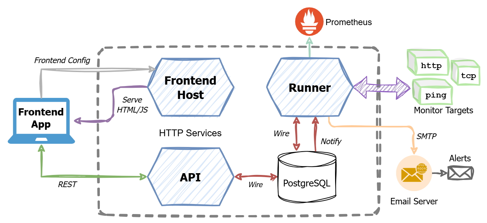

# {{ icon }} Overview Of The Application

This section simply serves as an introduction to the application, there are no tasks to be carried out.

The application is called 'NanoMon'. NanoMon is a lightweight network and HTTP monitoring system, designed to be self
hosted any container based system e.g. Kubernetes or various cloud services, or run locally.

> We have no particular interest in the features of Nanomon or actually using it! It has been selected as representing a
> good example application to deploy, given it has multiple components, and is fairly indicative of many of the
> applications & systems you might find yourself running in Kubernetes.

Project link: [Nanomon - GitHub Repo & Project](https://github.com/benc-uk/nanomon)

The application consists of several lightweight containerized microservices and single page application, it is written
in Go and React/TypeScript.

- A frontend service serving static content of the frontend <abbr title="Single Page Application">SPA</abbr> + simple
  configuration endpoint.
- A backend data API service for the frontend to consume using REST.
- A backend worker component called a runner.
- A PostgreSQL database for persisting data & state.

The design adheres to a now ubiquitous pattern for running single page apps:

{class=diagram}

For this workshop the system will be deployed with the following criteria:

- Both the API and frontend need to be **exposed to the public internet**. Both use HTTP as a protocol.
- The PostgreSQL database runs inside the cluster, **but not exposed externally**
  - Many arguments rage on whether it is good practice to run stateful workloads like a database in Kubernetes. For the
    purposes of this workshop we shall, in the interests of both speed and to demonstrate some key concepts. For your
    production workloads I advise you do some
    [reading and research](https://www.google.com/search?q=should+i+run+a+database+in+kubernetes) first
- The runner similarly will be configured with no incoming connectivity.
- Authentication and API security will disabled and the app will run in "no-auth mode"
