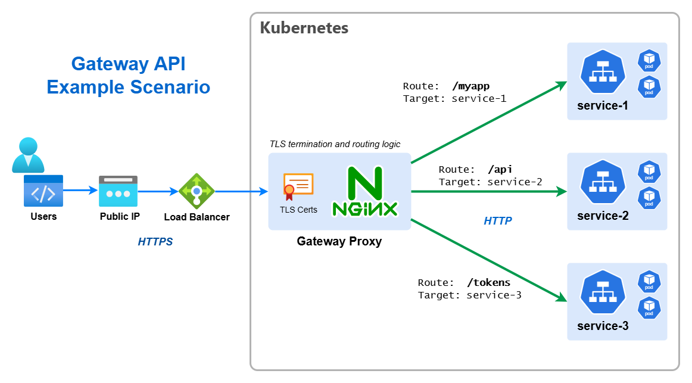
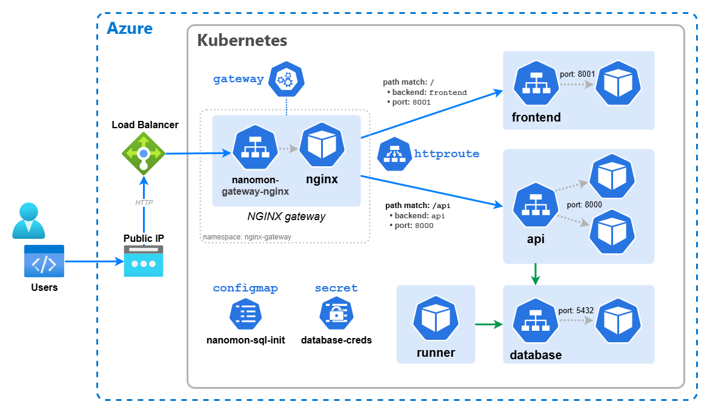

# {{ icon }} {{ title }}

🔥 This section is an alternative to the [Helm & Ingress section](../09-helm-ingress/), but instead of covering the
legacy Ingress API, it uses the newer Gateway API which is still evolving, but represents the future of L4/L7 routing in
Kubernetes. Do not run through both sections, choose one or the other. 🔥

---

For this section we'll touch on two slightly more advanced topics, these are use of Helm and introducing an gateway data
plane to our cluster. The gateway will let us further refine & improve the networking aspects of the app we've deployed.

## 📌 The Gateway API

The Kubernetes Gateway API is an official Kubernetes project focused on L4 and L7 routing in Kubernetes. This project
represents the next generation of Kubernetes Ingress, Load Balancing, and Service Mesh APIs. It is designed to improve
upon the existing Ingress API by providing more expressive and extensible resource definitions. It is still evolving but
slowly replacing the older Ingress API.

[📚 Learn more about the Gateway API](https://gateway-api.sigs.k8s.io/)

> Do not confuse the "Gateway API" with "API Gateway" products like AWS API Gateway or Azure API Management & Azure App
> Gateway, or even the generic term "API Gateway". The Gateway API is a Kubernetes-native API for managing L4/L7
> routing. It would be valid to say "Let's use the Gateway API to route traffic through our API Gateway". Look I know,
> it's confusing, I wasn't involved in the naming!



## 🧙 Intro to Custom Resources

Kuberentes is designed to be extensible,in fact, extremely so. The core Kubernetes API is made up of a number of
_pre-defined_ resources like _Pods_, _Deployments_, _Services_, etc. But Kubernetes also allows anyone to define their
own resources, these are called _Custom Resources_. The Gateway API is implemented as a set of _Custom Resources_ (until
such time as it is merged into the core Kubernetes API set).

Before we can use the Gateway API in our cluster and create instances of the resources, we need to install these _Custom
Resource Definitions_ (CRDs) which define the new resources. This is done with a single command:

```bash
kubectl apply --server-side -f https://github.com/kubernetes-sigs/gateway-api/releases/download/v1.4.1/standard-install.yaml
```

## 🗃️ Namespaces

So far we've worked in a single _Namespace_ called `default`, but Kubernetes allows you create additional _Namespaces_
in order to logically group and separate your resources.

> Namespaces do not provide any form of network boundary or isolation of workloads, and the underlying resources (Nodes)
> remain shared. There are ways to achieve higher degress of isolation, but it is a matter well beyond the scope of this
> workshop.

Create a new namespace called `nginx-gateway`:

```bash
kubectl create namespace nginx-gateway
```

Namespaces are simple idea but they can trip you up, you will have to add `--namespace` or `-n` to any `kubectl`
commands you want to use against a particular namespace. The following alias can be helpful to set a namespace as the
default for all `kubectl` commands, meaning you don't need to add `-n`, think of it like a Kubernetes equivalent of the
`cd` command.

```bash
# Note the space at the end
alias kubens='kubectl config set-context --current --namespace '
```

## 🪖 Introduction to Helm

[Helm is an CNCF project](https://helm.sh/) which can be used to greatly simplify deploying applications to Kubernetes,
either applications written and developed in house, or external 3rd party software & tools.

- To use Helm, the Helm CLI tool `helm` is required.
- Helm simplifies deployment using the concept called a _chart_, when a chart is deployed it is refereed to as a
  _release_.
- A _chart_ consists of one or more Kubernetes YAML templates + supporting files.
- Helm charts support dynamic parameters called _values_. Charts expose a set of default _values_ through their
  `values.yaml` file, and these _values_ can be set and over-ridden at _release_ time.
- The use of _values_ is critical for automated deployments and CI/CD.
- Charts can referenced through the local filesystem, or in a remote repository called a _chart repository_

## 🚪 Deploying the NGINX Gateway

For this section we'll be using the [NGINX Gateway](https://docs.nginx.com/nginx-gateway-fabric/) as our gateway
implementation, this is a open source project which supports the Gateway API. There are other options available,
including commercial products, but NGINX is a good choice for this workshop as it is free, open source, and widely used.

```bash
helm install ngf oci://ghcr.io/nginx/charts/nginx-gateway-fabric --namespace nginx-gateway
```

This command does the following:

- `helm install` - installs a new Helm chart as a release
- `ngf` - the name of the release, you can choose any name you like
- `oci://ghcr.io/nginx/charts/nginx-gateway-fabric` - the location of the chart, in case it's a special type of remote
  URL
- `--namespace nginx-gateway` - the namespace to install the NIGNX controler & proxy into

## 🛠️ Configuring the Gateway

Now we have the NGINX Gateway installed, we need to configure it to route traffic to our application. This is done using
a `Gateway` resource, this would typically be set up once by a cluster administrator, not the application developer, but
today we are wearing multiple hats!

[📚 Gateway Resource](https://gateway-api.sigs.k8s.io/api-types/gateway/)

Cretate a file called `gateway.yaml` with the following content:

```yaml
apiVersion: gateway.networking.k8s.io/v1
kind: Gateway

metadata:
  name: nanomon-gateway

spec:
  gatewayClassName: nginx
  listeners:
    - name: http
      port: 80
      protocol: HTTP
      # This is required to allow routes from other namespaces
      allowedRoutes:
        namespaces:
          from: All
```

> Normally the `hostname` field would be set to a specific hostname, or some wildcard, but for this workshop we are
> using the external IP address of the Load Balancer without any DNS, so we leave it unset.

Apply the configuration but place it in the `nginx-gateway` namespace with the following command. This allows us to
separate the gateway resources from the application resources:

```
kubectl apply -f gateway.yaml -n nginx-gateway
```

This will actually create the gateway instance (the Helm install you ran previously didn't do that), i.e. the NGINX
proxy which will route traffic, and along with it a Service of type `LoadBalancer` which will give it an external IP
address.

To get this external IP address, run: `kubectl get svc -n nginx-gateway` and look for the service called
`nanomon-gateway-nginx`. It may take a few minutes for the external IP to be assigned, but once it is, make a note of
it.

If you go to this external IP address in your browser, you should see a 404 error, this is because we haven't yet
configured any _routes_ to our application.

## 🔒 Reconfiguring The App

Now we need to modify the app we've deployed to route through our new new gateway, but a few simple changes are required
first. As the gateway will be fronting all requests, the services in front of the deployments should be switched back to
internal i.e. `ClusterIP`.

- Edit both the data API & frontend _Service_ YAML manifests, change the service type to `ClusterIP`
- Change the ports to `8000` for the API and `8001` for the frontend, this is the ports the containers are listening,
  remove the `targetPort` field, so they look like this:
  ```
    ports:
    - protocol: TCP
      port: 8000
  ```
- Edit the frontend _Deployment_ YAML manifest, change the `API_ENDPOINT` environmental variable to use the same origin
  URI `/api` no need for a scheme or host.

Apply these three changes with `kubectl` and now the app will be temporarily unavailable. Note, if you have changed
namespace with `kubens` you should switch back to the **default** namespace before running the apply!

If run `kubectl get svc` you should see both services are now of type `ClusterIP` and have no external IP associated.

## 🔀 Configuring Routes

Routes are configured using two new resources, `HTTPRoute` and `TLSRoute`. For this workshop we'll just be using
`HTTPRoute`.

[📚 HTTPRoute Resource](https://gateway-api.sigs.k8s.io/api-types/httproute/

Create a file called `http-route.yaml` with the following content:

```yaml
apiVersion: gateway.networking.k8s.io/v1
kind: HTTPRoute

metadata:
  name: nanomon-routes

spec:
  parentRefs:
    - namespace: nginx-gateway
      name: nanomon-gateway
      sectionName: http
  rules:
    - matches:
        - path:
            type: PathPrefix
            value: /
      backendRefs:
        - name: frontend
          port: 8001
    - matches:
        - path:
            type: PathPrefix
            value: /api
      backendRefs:
        - name: api
          port: 8000
```

This configuration does the following:

- Creates a `HTTPRoute` resource
- Links the route to the `nanomon-gateway` gateway we created earlier, which is in the `nginx-gateway` namespace
- Defines two routing rules:
  - Requests with a path prefix of `/` are routed to the `frontend` service on port `8001`
  - Requests with a path prefix of `/api` are routed to the `api` service on port `8000`

Apply the configuration with: `kubectl apply -f http-route.yaml`

> You could have defined two separate `HTTPRoute` resources, each with a single rule, but this is more concise and it's
> unlikely you'd want to manage them separately.

If you go to the external IP address of the gateway in your browser, you should now see the frontend of the app. Also if
you go to `http://<external-ip>/api/status` you should see the API status endpoint.

## 🖼️ Cluster & Architecture Diagram

We've reached the final state of the application deployment, yes I promise this time! The resources deployed into the
cluster & in Azure at this stage can be visualized as follows:



This is a slightly simplified version from previously in order to fit everything in, so things like the _Deployment_
resources have been omitted.
