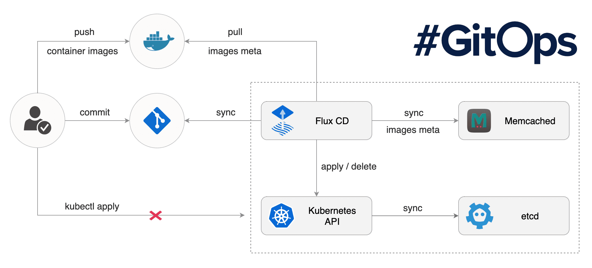

# {{ icon }} GitOps & Flux

This is an advanced optional section going into two topics; Kustomize and also GitOps, using FluxCD.

## 🪓 Kustomize

Kustomize is a tool for customizing Kubernetes configurations.

Kustomize traverses Kubernetes manifests to add, remove or update configuration options. It is available both as a
[standalone binary](https://kubectl.docs.kubernetes.io/installation/kustomize/) and as a native feature of kubectl. It
can be thought of as similar to Helm where it provides a means to template and parameterize Kubernetes manifests.

Kustomize works by looking for `kustomization.yaml` files and operating on their contents.

[These slides](https://speakerdeck.com/spesnova/introduction-to-kustomize) provide a fairly good introduction.

To demonstrate Kustomize in practice, we can carry out a simple exercise, create a new directory called `base`.

> We do not use the NanoMon app here, and the examples are kept deliberately simple to demonstrate the concepts.

Place the the following two files into it:

<details>
<summary>Contents of base/deployment.yaml</summary>

```yaml
apiVersion: apps/v1
kind: Deployment
metadata:
  name: webserver
spec:
  selector:
    matchLabels:
      app: webserver
  template:
    metadata:
      labels:
        app: webserver
    spec:
      containers:
        - name: webserver
          image: nginx
          resources:
            limits:
              memory: "128Mi"
          ports:
            - containerPort: 80
```

</details>

<details>
<summary>Contents of base/kustomization.yaml</summary>

```yaml
apiVersion: kustomize.config.k8s.io/v1beta1
kind: Kustomization
resources:
  - deployment.yaml
```

</details>

Now run kustomize via kubectl, giving it the path to the base directory as follows:

```bash
kubectl kustomize ./base
```

You will see the YAML printed to stdout, as we've not provided any changes in the `kustomization.yaml` all we get is a
1:1 version of the `deployment.yaml` file. This isn't very useful!

To better understand what Kustomize can do, create a second directory at the same level as `base` called `overlay`.

<details>
<summary>Contents of overlay/override.yaml</summary>

```yaml
apiVersion: apps/v1
kind: Deployment
metadata:
  name: webserver

spec:
  template:
    spec:
      containers:
        - name: webserver
          resources:
            requests:
              cpu: 50m
              memory: 50Mi
          env:
            - name: SOME_ENV_VAR
              value: Hello!
```

</details>

<details>
<summary>Contents of overlay/kustomization.yaml</summary>

```yaml
apiVersion: kustomize.config.k8s.io/v1beta1
kind: Kustomization

# Reference to a base kustomization directory
resources:
  - ../base

# You can add suffixes and prefixes
nameSuffix: -dev

# Modify the image name or tags
images:
  - name: nginx
    newTag: 1.21-alpine

# Apply patches to override and set other values
patches:
  - ./override.yaml
```

</details>

Some points to highlight:

- The _Kustomization_ adds a suffix to the names of resources.
- Also the _Kustomization_ changes the image tag to reference a specific tag.
- The patch `override.yaml` file looks a little like a regular Kubernetes _Deployment_ but it only contains the part
  that will be patched/overlayed onto the base resource. On its own it's not a valid manifest.
  - The patch file sets fields in the base _Deployment_ such as changing the resource limits and adding an extra
    environmental variable.

See the [reference docs](https://kubectl.docs.kubernetes.io/references/kustomize/kustomization/) for all the options
available in the kustomization.yaml file.

The file & directory structure should look as follows:

```text
├── base
│   ├── deployment.yaml
│   └── kustomization.yaml
└── overlay
    ├── kustomization.yaml
    └── override.yaml
```

> The names "base" and "overlay" are not special, often "environments" is used instead of "overlay", with
> sub-directories for each environment.

Now running:

```bash
kubectl kustomize ./overlay
```

You will now see the overrides and modifications from the overlay applied to the base resources. With the modified nginx
image tag, different resource limits and additional env var.

This could be applied to the cluster with the following command `kubectl -k ./overlay apply`, however there is no need
to do this.

## GitOps & Flux

GitOps is a methodology where you declaratively describe the entire desired state of your system using git. This
includes the apps, config, dashboards, monitoring and everything else. This means you can use git branches and PR
processes to enforce control of releases and provide traceability and transparency.

{class=diagram}

Kubernetes doesn't support this concept out of the box, it requires special controllers to be deployed and manage this
process. These controllers run inside the cluster, monitor git repositories for changes and then make the required
updates to the state of the cluster, through a process called reconciliation.

We will use the [popular project FluxCD](https://fluxcd.io/) (also just called Flux or Flux v2), however other projects
are available such as ArgoCD and support from GitLab.

As GitOps is a "pull" approach, it also allows you to lock down your Kubernetes cluster, and prevent developers and
admins making direct changes with kubectl (a "push" approach). This can be a requirement for some organizations and is a
key part of the GitOps methodology to have a single source of truth.

### 💽 Install Flux into AKS

[Flux is available as an AKS Extension](https://docs.microsoft.com/en-us/azure/azure-arc/kubernetes/tutorial-use-gitops-flux2)
which is intended to simplify installing Flux into your cluster & configuring it, however it requires some extensions to
the Azure CLI to be installed first.

Add the CLI extensions with:

```bash
az extension add -n k8s-configuration
az extension add -n k8s-extension
```

It also requires some
[preview providers](https://docs.microsoft.com/en-us/azure/azure-arc/kubernetes/tutorial-use-gitops-flux2#for-azure-kubernetes-service-clusters)
to be enabled on your Azure subscription. Follow out these steps before proceeding, which can take some time!

Before we configure anything GitOps needs a git repo to work against. We'll have to use a fork of this repo, to set this
up:

- Go to the repo for this workshop [https://github.com/benc-uk/kube-workshop](https://github.com/benc-uk/kube-workshop).
- Fork the repo to your own personal GitHub account, by clicking the 'Fork' button near the top right.

Now to set up Flux, run the following command, replacing the `{YOUR_GITHUB_USER}` part with your GitHub username you
used for forking the repo:

```bash
az k8s-configuration flux create \
 --resource-group ${RES_GROUP} --cluster-name ${AKS_NAME} \
 --name flux --namespace flux-system --cluster-type managedClusters --scope cluster \
 --url https://github.com/{YOUR_GITHUB_USER}/kube-workshop --branch main --interval 1m \
 --kustomization name=apps path=gitops/apps prune=true sync_interval=1m
```

This one command is doing a LOT of things, it's adding an extension to AKS, deploying Flux to the cluster (with all the
Pods and CRDs) and it's adding the _GitRepo_ to be scanned and checked. It will take a few minutes to complete, be
patient!

Check the status of Flux with the following commands:

```bash
kubectl get kustomizations -A

kubectl get gitrepo -A

kubectl get pod -n flux-system
```

> The resource types `kustomizations` and `gitrepo` are not part of the standard Kubernetes API, these are CRDs (Custom
> Resource Definitions) added by Flux when it was installed.

You should also see a new namespace called "hello-world", check with `kubectl get ns` this has been created by the
`gitops/apps/hello-world.yaml` file in the repo and automatically applied by Flux.

You can also view this configuration from the Azure portal, under the "GitOps" view under the AKS cluster resource.

### 🚀 Deploying Resources

USe git to clone the kube-workshop repo you forked earlier, and open the directory in VS Code or other editor.

If you recall from the bootstrap command earlier we gave Flux a path within the repo to use and look for configurations,
which was `gitops/apps` directory. The contents of the whole of the `gitops/` directory is shown here.

```text
├── apps
│   └-─ hello-world.yaml
├── base
│   ├── backend
│   │   ├── api-deployment.yaml
│   │   ├── api-service.yaml
│   │   ├── kustomization.yaml
│   │   └── runner-deployment.yaml
│   ├── frontend
│   │   ├── deployment.yaml
│   │   ├── ingress.yaml
│   │   ├── kustomization.yaml
│   │   └── service.yaml
│   └── postgres
│       ├── kustomization.yaml
│       ├── service.yaml
│       └── statefulset.yaml
└── disabled
    ├── nanomon
    │   └── kustomization.yaml
    └── postgres
        ├── kustomization.yaml
        ├── nanomon_init.sql
        └── overrides.yaml
```

The key thing about this structure is the `gitops/base` directory provides us a set of Kustomization-based resources we
can use, but as it's outside of the `gitops/apps` path they will not auotmatically be picked up by Flux, until we create
a Kustomization under `gitops/apps` that references them.

⚠️ **STOP!** Before we proceed, ensure the `database-creds` _Secret_ from the previous sections is still in the default
namespace. If you have deleted it, [hop back to section 7](../07-improvements/#-secrets) and quickly create it again,
it's just a single command. Creating _Secrets_ using the GitOps approach is problematic, as it expects everything to be
committed into a code repo. Flux supports solutions to this, such as using
[SOPS](https://fluxcd.io/docs/guides/mozilla-sops/) and [Sealed Secrets](https://fluxcd.io/docs/guides/sealed-secrets/)
but for an intro such as this, they require too much extra setup, so we will skip over them.

First let's deploy PostgreSQL using Flux:

- Copy the `postgres/` directory from "disabled" to "apps".
  - Note the `kustomization.yaml` in here is pointing at the base directory `../../base/postgres` and overlaying it.
- Git commit these changes to the main branch and push up to GitHub.
- Wait for ~1 minute for Flux to rescan the git repo.
- Check for any errors with `kubectl get kustomizations -A`.
- Check the default namespace for the new PostgreSQL _StatefulSet_ and _Pod_ using `kubectl get sts,pods -n default`.

Next deploy the Nanomon app:

- Copy the `nanomon/` directory from "disabled" to "apps".
  - Note the `kustomization.yaml` in here is pointing at **several** base directories, for the app backend and frontend.
- Edit the ACR names in the `gitops/apps/nanomon/kustomization.yaml` file.
- Git commit these changes to the main branch and push up to GitHub.
- Wait for ~1 minute for Flux to rescan the git repo.
- Check for any errors with `kubectl get kustomizations -A`.
- Check the default namespace for the new resources using `kubectl get deploy,pods,ingress -n default`.

If you encounter problems or want to force the reconciliation you can use the `flux` CLI, e.g.
`flux reconcile source git flux`.

If we wanted to deploy this app across multiple environments or multiple times, we could create sub-directories under
`apps/`, each containing different Kustomizations and modifying the deployment to suit that environment. There's
countless ways to structure this, and it very much depends on your requirements.
