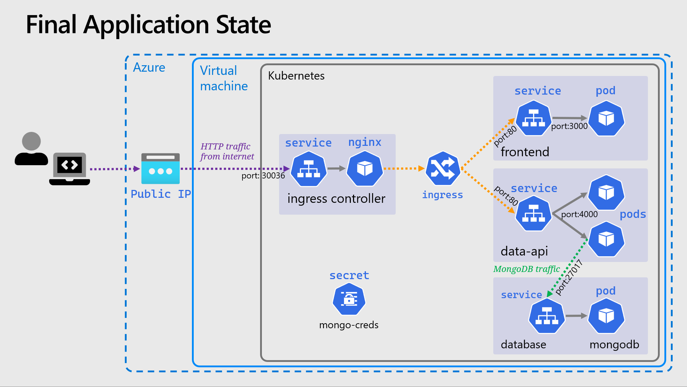

# 🌎 Helm & Ingress

For this section we'll touch on two slightly more advanced topics, the key ones being the use of Helm and introducing an ingress controller to our cluster. The ingress will let us further refine & improve the networking aspects of the app we've deployed.

## 🗃️ Namespaces

So far we've worked in a single _Namespace_ called `default`, but Kubernetes allows you create additional _Namespaces_ in order to logically group and separate your resources.

> 📝 NOTE: Namespaces do not provide a network boundary or isolation of workloads, and the underlying resources (Nodes) remain shared. There are ways to achieve these outcomes, but is well beyond the scope of this workshop.

Namespaces are simple idea but they can trip you up, you will have to add `--namespace` or `-n` to any `kubectl` commands you want to use against a particular namespace. The following alias can be helpful to set a namespace as the default for all `kubectl` commands, meaning you don't need to add `-n`, think of it like a Kubernetes equivalent of the `cd` command.

```bash
# Note the space at the end
alias kubens='kubectl config set-context --current --namespace '
```

and to add to your `.bashrc`

```bash
# Note the space at the end
echo "alias kubens='kubectl config set-context --current --namespace '" >> ~/.bashrc 
```

## 🚀 Deploying The Ingress Controller

https://kubernetes.github.io/ingress-nginx/deploy/#bare-metal-clusters

```sh

curl https://raw.githubusercontent.com/kubernetes/ingress-nginx/controller-v1.3.0/deploy/static/provider/baremetal/deploy.yaml -o moo.yaml
```

An [ingress controller](https://kubernetes.io/docs/concepts/services-networking/ingress-controllers/) provides a reliable and secure way to route HTTP and HTTPS traffic into your cluster and expose your applications from a single point of ingress; hence the name.


- The controller is simply an instance of a HTTP reverse proxy running in one or mode _Pods_ with a _Service_ in front of it.
- It implements the [Kubernetes controller pattern](https://kubernetes.io/docs/concepts/architecture/controller/#controller-pattern) scanning for _Ingress_ resources to be created in the cluster, when it finds one, it reconfigures itself based on the rules and configuration within that _Ingress_, in order to route traffic.
- There are [MANY ingress controllers available](https://kubernetes.io/docs/concepts/services-networking/ingress-controllers/#additional-controllers) but we will use a very common and simple one, the [NGINX ingress controller](https://kubernetes.github.io/ingress-nginx/) maintained by the Kubernetes project
- Often TLS is terminated by the ingress controller, and sometimes other tasks such as JWT validation for authentication can be done at this level. For the sake of this workshop no TLS & HTTPS will be used due to the dependencies it requires (such as DNS, cert management etc)

Helm greatly simplifies setting this up, down to a single command. Run the following:

```bash
helm install my-ingress ingress-nginx/ingress-nginx \
  --namespace ingress \
  --set controller.replicaCount=2
```

- The release name is `my-ingress` which can be anything you wish, it's often used by chart templates to prefix the names of created resources.
- The second parameter is a reference to the chart, in the form of `repo-name/chart-name`, if we wanted to use a local chart we'd simply reference the path to the chart directory.
- The `--set` part is where we can pass in values to the release, in this case we increase the replicas to two, purely as an example.

Check the status of both the pods and services with `kubectl get svc,pods --namespace ingress`, ensure the pods are running and the service has an external public IP.

You can also use the `helm` CLI to query the status, here's some simple and common commands:

- `helm ls` or `helm ls -A` - List releases or list releases in all namespaces.
- `helm upgrade {release-name} {chart}` - Upgrade/update a release to apply changes. Add `--install` to perform an install if the release doesn't exist.
- `--dry-run` - Add this switch to install or upgrade commands to get a view of the resources and YAML that would be created, without applying them to the cluster.
- `helm get values {release-name}` - Get the values that were used to deploy a release.
- `helm delete {release-name}` - Remove the release and all the resources.

## 🔀 Reconfiguring The App With Ingress

Now we can modify the app we've deployed to route through the new ingress, but a few simple changes are required first. As the ingress controller will be routing all requests, the services in front of the deployments should be switched back to internal i.e. `ClusterIP`.

- Edit both the data API & frontend **service** YAML manifests, change the service type to `ClusterIP`  and remove `nodePort` field then reapply with `kubectl apply`
- Edit the frontend **deployment** YAML manifest, change the `API_ENDPOINT` environmental variable to use the same origin URI `/api` no need for a scheme or host.

Apply these three changes with `kubectl` and now the app will be temporarily unavailable. Note, if you have changed namespace with `kubens` you should switch back to the **default** namespace before running the apply.

The next thing is to configure the ingress by [creating an _Ingress_ resource](https://kubernetes.io/docs/concepts/services-networking/ingress/). This can be a fairly complex resource to set-up, but it boils down to a set of HTTP path mappings (routes) and which backend service should serve them, here is the completed manifest file of `ingress.yaml`:

<details markdown="1">
<summary>Click here for the Ingress YAML</summary>

```yaml
apiVersion: networking.k8s.io/v1
kind: Ingress

metadata:
  name: my-app
  labels:
    name: my-app

spec:
  # Important we leave this blank, as we don't have DNS configured
  # Blank means these rules will match ALL HTTP requests hitting the controller IP
  host:
  # This is important and required since Kubernetes 1.22
  ingressClassName: nginx
  rules:
    - http:
        paths:
          # Routing for the frontend
          - pathType: Prefix
            path: "/"
            backend:
              service:
                name: frontend
                port:
                  number: 80

          # Routing for the API
          - pathType: Prefix
            path: "/api"
            backend:
              service:
                name: data-api
                port:
                  number: 80
```

</details>

Apply the same as before with `kubectl`, validate the status with:

```bash
kubectl get ingress
```

It may take it a minute for it to be assigned an address, note the address will be the same as the external IP of the ingress-controller (you can check this with `kubectl get svc -n ingress | grep LoadBalancer`)

Visit this IP in your browser, if you check the "About" screen and click the "More Details" link it should take you to the API, which should now be served from the same IP as the frontend.

## 🖼️ Cluster & Architecture Diagram

We've reached the final state of the application deployment. The resources deployed into the cluster & in Azure at this stage can be visualized as follows:



This is a slightly simplified version from previously, and the _Deployment_ objects are not shown.

### [Return to Main Index](../../readme.md)
